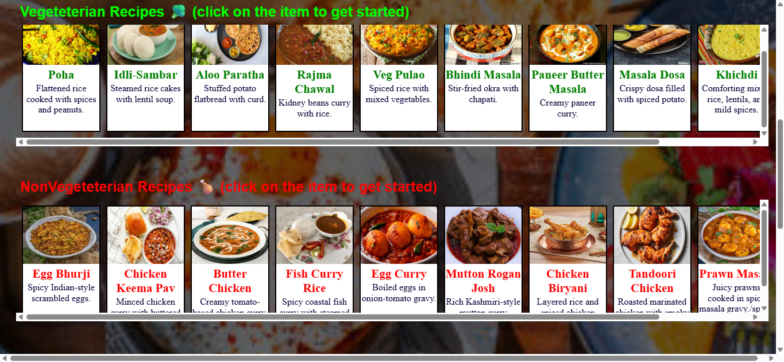

# RecipeKhazana 🍛

RecipeKhazana is a static recipe website created using only **HTML** and **CSS**. It presents a handpicked collection of Indian recipes with a visually clean layout, responsive design, and an emphasis on accessibility and presentation.

## 🌟 Features

- 📌 Fully static website (no JavaScript)
- 🍽️ Sections for veg, non-veg, vegan, and gym-friendly recipes
- 📷 Background images with brightness filter
- 📱 Responsive layout using Flexbox
- 📌 Sticky navigation bar for easy access
- 📎 Footer with styled social media links

## 🛠️ Built With

- HTML5 for structure
- CSS3 for layout, styling, and responsiveness

## 📸 Screenshot

## 🔗 GitHub Profile
[Parth Kamath](https://github.com/ParthK604)
